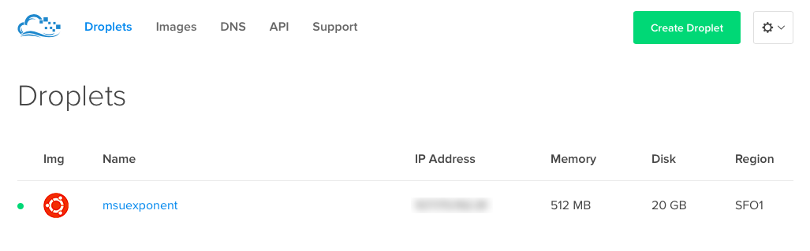
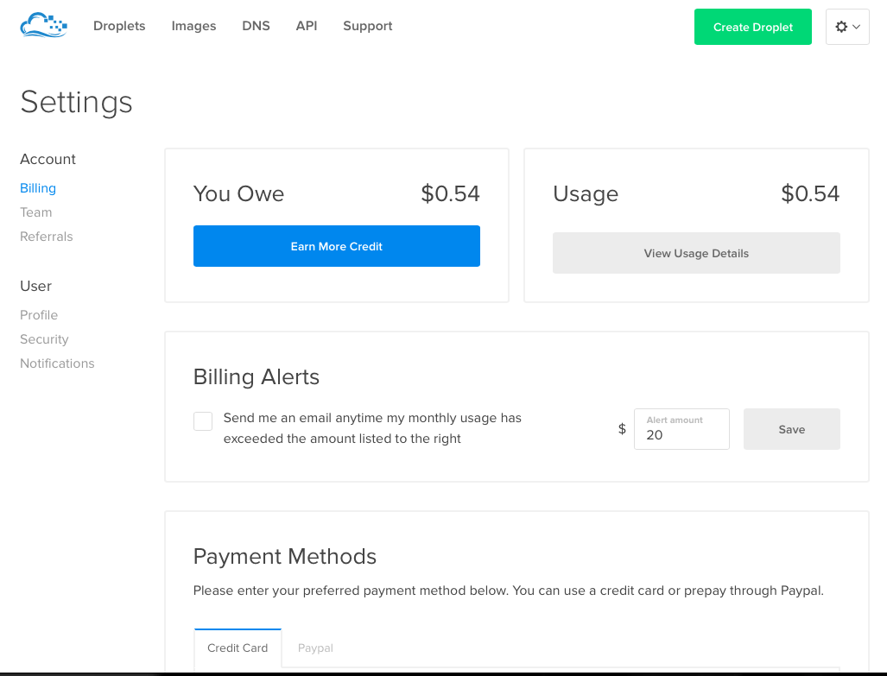

<link rel="stylesheet" href="../style.css">

### Host

To access the hosting control panel, login to Digital Ocean with the Exponent’s credentials. 

Click on the gears icon on the right to access the dropdown menu and go to ‘Settings’. This will take you directly to the Billing information page. The current amount due will be displayed followed by the available payment options. If automatic payments are not set up by default, please contact the Editor in Chief or the ASMSU Operations Manager to set this up.

