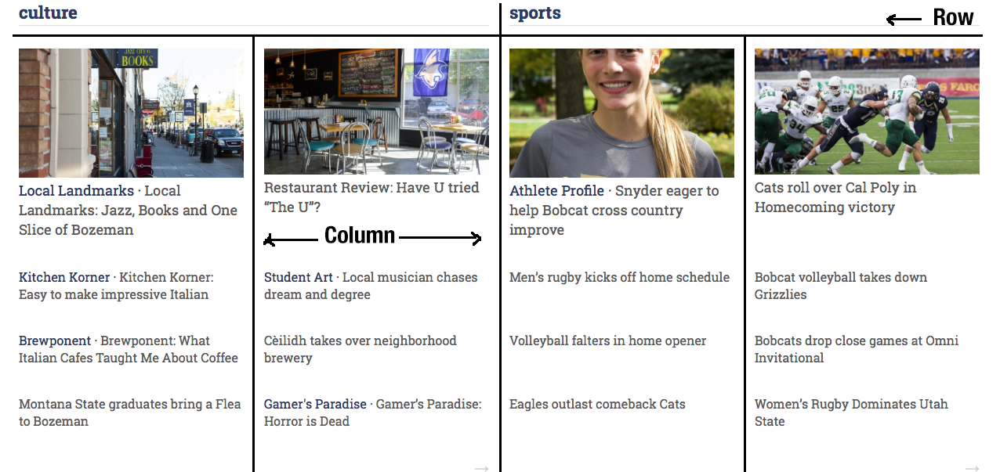

<h4>Foundation</h4>

Foundation is a responsive front-end framework. It provides a responsive grid and HTML and CSS UI components, templates, and code snippets, including typography, forms, buttons, navigation and other interface components, as well as optional JavaScript extensions.

This is an example of a grid layout used on the front page. There are two rows, the first for the section headings and the second for the content. There are two columns, one for each of the two sections shown. Within each of these columns there are two columns as well to split the content on display.

A full list of Foundation’s elements can be found in Foundation’s documentation. The primary Foundation elements used in The MSU Exponent theme are:

<ul>
	<li>Grid</li>
	<li>Block Grid</li>
	<li>Top bar</li>
	<li>Off-canvas</li>
	<li>Forms</li>
	<li>Buttons</li>
</ul>
