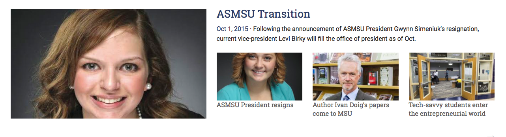

<h4>Layouts</h4>

The code for the layout shown above is found in the

parts/sections/desktop-tablet/featured.php

file and is included below:

	<!-- // Featured // -->

	

		
	

			<!-- Latest post thumbnail -->
			<?php get_featured_thumbnail(); ?>

		

		

			<!-- Latest post title -->
			<h3>
				<?php get_featured_title(); ?>
			</h3>

			<!-- Single sentence excerpt -->
			

				<?php get_featured_excerpt(); ?>
			

			<!-- Three posts with thumbnails --> 
			<?php get_featured_list(); ?>
			
		

	

	<!-- Get more posts -->
	

		

			<?php get_more_posts("featured"); ?>
		

	

There are two rows, one for the content and another for displaying a link to get more posts from that category. The content row consists of two columns which have a 5:7 ratio in terms of length. The left column contains a call to the function which displays the latest post thumbnail from the “Featured” category. The right column displays the post title and an excerpt from the same post used in the left column. Additionally, it also includes a call to a function which displays the three latest posts with their thumbnails using Foundation’s “Block Grid” element.

At a higher level, the layout for the front page consists of calls to partials in the parts/layouts/desktop-tablet.php file:

	

		<?php get_template_part('parts/sections/desktop-tablet/featured'); ?>

		<?php get_template_part('parts/sections/desktop-tablet/news-opinion-multimedia'); ?>

		<?php get_template_part('parts/sections/desktop-tablet/culture-sports'); ?>

	

The folder structure can be summed up as follows:

parts/sections:

Contains the low-level grid layout for each section (category).

parts/layouts:

Contains the top-level grid layout for all the sections.

library/sections:

Contains the functions for each section that have been called in the section files. 

