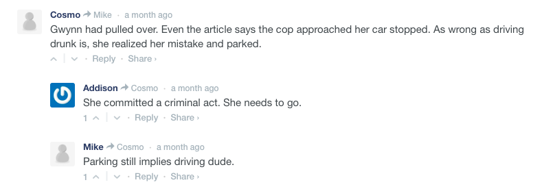

<h4>Disqus</h4>

Disqus is a third-party comment system that replaces the default WordPress comment system. It makes commenting easier and more interactive, while connecting websites and commenters across a thriving discussion community. The Disqus for WordPress plugin is enabled, which seamlessly integrates using the Disqus API and by syncing with WordPress comments. A link to Disqus’ comment moderation page is included in the WordPress administrative dashboard.